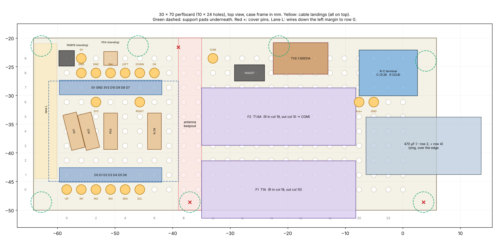

# Hardware

## HVAC wiring at the wall

The system is a heat pump with electric aux strips, controlled by a 2-heat / 1-cool thermostat.

| Wire | Old terminal | Function |
|---|---|---|
| Red | Rh, jumpered to Rc | 24 VAC hot (one transformer) |
| Blue | C | 24 VAC common, which is board GND |
| Yellow | Y1 | Compressor |
| Green | G | Blower |
| Orange | O | Reversing valve, **energised in COOL** |
| White | W1/E, jumpered to W2 | Aux and emergency strips |

B is unused.

## Power

```
R ──F1 T1A──1N4007──┬─ 470µF 63V ─┬─ 1.5KE51A ─┬─ XL7015 (set 5.00 V) ──┬─ relay module DC+
                    │             │            │                        └─1N5819─ XIAO 5V
C ──────────────────┴─────────────┴────────────┴─ GND (relay DC−, XIAO GND)

R ──F2 T1.6A── relay COM1..COM4 (jumpered)
```

- **Half-wave rectification.** It keeps C = GND, so plugging USB into a PC while the board is on 24 VAC is safe. Check C-to-earth continuity first anyway.
- **Bus voltage.** The DC bus sits at about 33–39 V peak. The XL7015 accepts 5–80 V. Set its output to 5.00 V **before** connecting any load, then lock the trimpot with a dab of nail polish.
- **Relay contacts.** The contacts switch R onto Y1, G, O and W. The SRD relays are rated 10 A.
- **F2 sizing.** About 1.25 A is the contactor *inrush*, which a T fuse rides through; the steady Heat + aux load is typically 0.6–1.2 A. After installation, clamp-meter R in heat, cool, heat + aux and e-heat. Keep T1.6A if the steady current is ≤ 1.1 A, otherwise fit T2A (18 AWG and the contacts allow it).

## Relay module (AEDIKO 4-ch, H/L trigger)

- **Board (measured).** The PCB is 73 × 50 mm, with Ø3.1 mm holes on a 67 × 44.5 mm pattern. Relays stand 15.5 mm above the board, the screw terminals 10 mm.
- **Terminals.** All connections are screw terminals: a 12-way block along one long edge (NO, COM, NC for each relay) and a 6-way block for DC+, DC−, IN1–IN4. There is no pin header to remove. Mount the module with the 12-way block toward the wire window.
- **Jumpers.** Set all four trigger jumpers S1–S4 to **H**. This board has no JD-VCC jumper.
- **Clearance.** The relay tops sit 1–2 mm under the cover. The module must sit flat on its four bosses.
- **Light leaks.** Cover the on-board relay LEDs with Kapton so they don't glow through the top vents.
- **Terminal order is not confirmed.** The CAD assumes NO, COM, NC from the left of each group. Bring-up step 2 checks it before any field wire lands; paint-mark the four NO screws.
- **3.3 V drive.** The IN inputs must pull in from a XIAO GPIO (3.3 V), not just from 5 V. If they don't (see step 2), set S1–S4 to **L** and add one NPN per channel (2N3904, 2N2222 or a 2N7000): collector to IN, emitter to GND, base from the GPIO through 2.2–4.7 k, and keep the 10 k pull-down on the GPIO. GPIO high still means energised and a floating or low GPIO still means off. Never use an inverting pull-up stage in H mode: every relay would turn on at boot.

| Channel | Load |
|---|---|
| IN1 | Y1 |
| IN2 | G |
| IN3 | O |
| IN4 | W |

## Pin map

**Board: Seeed XIAO ESP32-C6.** The assignments live in `components/board/include/board.h`, so re-pinning is a single edit.

| XIAO pin | GPIO | Use |
|---|---|---|
| D1 | 1 | IN1, Y1 |
| D2 | 2 | IN2, G |
| D3 | 21 | IN3, O |
| D10 | 18 | IN4, W |
| D4 | 22 | I2C SDA (SHT40 + OLED) |
| D5 | 23 | I2C SCL |
| D0 | 0 | D-pad up |
| D8 | 19 | D-pad down |
| D9 | 20 | D-pad left |
| D6 | 16 | D-pad right, **through a 1 k series resistor**. This is also U0TXD: the boot ROM drives it as the serial TX line at reset, so holding the key then would short a driven output to ground without the resistor. |
| D7 | 17 | D-pad centre |

- The D-pad switches each pull to GND and use the internal pull-ups.
- Pins a relay must never use, enforced by `tools/check_safety_sources.py`: strapping GPIO 4, 5, 8, 9 and 15; USB-Serial-JTAG GPIO 12 and 13; UART0 TX GPIO 16; SPI flash GPIO 24–30. The RF switch uses GPIO 3 and 14; leave them alone.
- Checked against Seeed's XIAO ESP32-C6 pinout (Oct 2026). GPIO15 is the on-board user LED and a strapping pin; GPIO3 (low = RF switch on) and GPIO14 (low = built-in antenna) are set by `board_init()`.
- The on-board user LED (GPIO15) blinks the output state in the bench (sim) build only.
- **Fit a 10 k pull-down from each IN pin to GND.** After a power-on the pins are floating inputs until the bootloader hook drives them low, tens of ms later.
- **After any other reset** (a crash, a watchdog, a software restart) the C6 keeps its GPIO outputs. The firmware drops the relays in the panic handler, in the restart path and again first thing in the bootloader (Oct 2026 bench check: without these, a relay stayed on about 0.67 s into the reboot).

## Controller board



A **30 × 70 mm perfboard with 10 × 24 holes** (2.54 mm) and no mounting holes, top face 7.6 mm above the wall plane (CAD x −64.2..5.8, y −50.0..−20.0). Hole (column 0, row 0) is at x −58.39, y −46.41; columns run along x, rows along y. Laid out by the round-4 three-agent review (docs/reviews/board_r4_*.md; the layout JSON is beside them).

- **Every cable wire lands on top, next to its pin.** The XIAO sits on rows 1 and 7, so row 0 below it and rows 8–9 above it are free for landings. The underside carries only one-pitch bridges on the logic side (stack ≤ 1.2 mm) and flat, non-crossing links on the power side (≤ 2.2 mm), in the 3 mm gap to the backplate. Flush-cut every tail to ≤ 1.2 mm.
- **Mounting:** no screws. The board sits on seven support pads inside six low fences plus two bumps off the left rim. Each fence has a 45° bead that the board snaps under (no flat overhang, so no supports). Three pins hung from the cover hold it down with the cover on.

| Part | Holes (column, row) | Notes |
|---|---|---|
| XIAO ESP32-C6 on female headers | columns 0–6; row 1 = D0–D6, row 7 = 5V GND 3V3 D10 D9 D8 D7 | USB-C at the left wall (cut 15 × 9). Remove the male headers' black spacer so the XIAO sits 8.5 mm up. Antenna at the column-6 end. |
| 10 k pull-downs IN1, IN2 | (1,2)→(0,6) and (2,2)→(1,6), lying diagonally under the XIAO | Signal lead bent underneath through (c,1) to the landing at (c,0); the other lead to GND. |
| 10 k pull-down IN3 | (3,2)→(3,6), under the XIAO | same scheme |
| 1 k, D6 series (RIGHT key) | (6,2)→(6,6), under the XIAO | (6,1)–(6,2) bridge; RIGHT lands at (5,6) |
| 10 k pull-down IN4 (D10) | standing over (3,9), hairpin to (2,9) | |
| 1N5819 | standing, anode body over (0,9), cathode hairpin to (0,8) | XL7015 OUT+ (5 V) lands at (1,9) |
| **Antenna keepout** | columns 7–9 | bare board, no metal, no 24 VAC |
| F1 (T1A, power) | pins at columns 10 and 19, **row 0** (overhangs the bottom edge 1.4 mm) | R in at column 19; out at column 10 |
| F2 (T1.6A, relay commons) | pins at columns 10 and 19, row 5 | R in at column 19; out at column 10 to the COM wire |
| 1N4007 | row 8, columns 11–14 | F1 → bus; anode lead sleeved down column 11 to (11,0)–(10,0) |
| 1.5KE51A TVS | row 9, columns 13–19 (cathode on 13) | across the bus |
| R-C terminal (5.08) | **C at (21,8), R at (23,8)** | wire entries face the top edge, toward the wall window |
| 470 µF 63 V | **− at (20,2), + at (20,4)**; body lying along x, over the right edge (leads bent 1.2 mm from the bung) | about 7.6 mm hangs past the board edge; glue it down. + lead sleeved to (20,6). |

**Cable landings (all on top):**

| Hole | Wire |
|---|---|
| (0,0) | cover UP |
| (1,0), (2,0), (3,0) | relay IN1, IN2, IN3 |
| (4,0), (5,0) | SDA, SCL (cover + SHT40 twisted together) |
| (2,6) | 3V3 (cover + SHT40), through the trough under the XIAO |
| (5,6) | cover RIGHT, through the trough |
| (1,8) | relay GND + XL7015 OUT− |
| (2,8) | cover GND + SHT40 GND |
| (1,9) | XL7015 OUT+ (5 V) + relay 5V |
| (3,8) | relay IN4 |
| (4,8), (5,8), (6,8) | cover LEFT, DOWN, OK |
| (20,6), (21,6) | XL7015 IN+ (bus), IN− (GND) |
| (21,8), (23,8) | field C, field R (terminal) |
| (10,9) | 18 AWG COM wire to the relay commons. Drill to 1.3 mm. |

**Underside links**

*Logic*, all one-pitch bridges:
- **UP, SDA, SCL:** (0,0)–(0,1), (4,0)–(4,1), (5,0)–(5,1).
- **IN1–IN3:** each pull-down's own signal lead runs (c,2)–(c,1)–(c,0).
- **GND:**
  - (0,6)–(1,6)–(1,7);
  - (3,6)–(3,5)–(2,5)–(1,5)–(1,6);
  - (1,7)–(1,8)–(2,8)–(2,9).
- **3V3:** (2,7)–(2,6).
- **D6 / RIGHT:** D6 (6,1)–(6,2); RIGHT (6,6)–(5,6).
- **5 V:** (0,7)–(0,8), (0,9)–(1,9).
- **IN4:** (3,7)–(3,8)–(3,9).
- **Keys:** (4,7)–(4,8), (5,7)–(5,8), (6,7)–(6,8).

*Power*, flat with no crossings:
- **R:** insulated 18 AWG from the terminal's R tail (23,8), along column 23 and row 0, to (20,0).
  - Bridges (20,0)–(19,0) (F1 in) and (19,0)–(18,0).
  - Bare 18 AWG up column 18 to (18,5)–(19,5) (F2 in).
- **GND:** bare 18 AWG from C (21,8) down column 21 to (21,2)–(20,2) (cap −). TVS anode (19,9)–(20,9)–(21,9)–(21,8).
- **Bus:**
  - TVS cathode (13,9)→(14,8)–(15,8);
  - insulated 18 AWG (15,8)→(20,7)–(20,6);
  - the cap's + lead sleeved from (20,4) to (20,6).
- **F1 out:** the 1N4007's anode lead, sleeved, from (11,8) down column 11 to (11,0)–(10,0).
- **COM:** the stripped end goes down from (10,9), sleeved, and is soldered to the F2 pin tail at (10,5).

**Never solder or bridge:** (19,1..4), (19,6), (20,1), (20,3), (20,5), every hole in column 22, (17,0..5), (4,6), (4,9), (5,9), (6,9), (6,0), and columns 7–9. These keep R, the bus and 24 VAC away from the logic pads. The only pad pairs where a bridge could hold a relay on are D10–3V3 and D3–SDA on the XIAO header, plus IN3–SDA on row 0. Bring-up step 0 catches all of them.

**Build order:**
1. **Fuse holders.** Solder the header pins to the legs, using the board as a jig. Tug-test them, check ≤ 0.05 Ω, and measure the installed height (≤ 17.9 mm).
2. **Under-XIAO parts,** before the headers go on: PD1–PD3 and the 1 k, with their bridges. Then the GND bridges on rows 5–6 and (2,7)–(2,6).
3. **Female headers on rows 1 and 7.** Use a XIAO as the jig, then flush-cut the tails.
4. **The 1N5819 and PD4,** both standing, plus the row 7–9 bridges.
5. **Power side:**
   1. Drill (10,9), and (21,8)/(23,8) if the terminal pins don't fit 1.0 mm holes.
   2. Fit the 1N4007, the TVS and the terminal.
   3. Fit the column-18 and column-21 straps and the two insulated links.
   4. Fit the fuse holders and epoxy their bases.
   5. Fit the 470 µF last.
6. **Bring-up step 0** (the ohm test below), then step 1.
7. **Install:** drive the wall screws first, then snap the board in and land the cables with the XIAO unplugged. Fit the XIAO last.

- **Not on the board:**
  - the XIAO 5V/3V3 100 nF (the XIAO has its own decoupling);
  - the optional I2C pull-ups (fit them on the SHT40 or OLED module if a probe shows none);
  - the 100 nF at the XL7015 output (on its own terminals);
  - the optional NPN drivers (a strip at the relay module).
- **Optional firmware re-pin** (not done): IN4→D0, UP→D10, SDA→D9, SCL→D8, LEFT→D4, DOWN→D5 would remove the three pad pairs above. It needs `board.h`, `tools/check_safety_sources.py` and the relay bench checks redone.
- **Antenna fallback:** if Thread signal is poor, use the XIAO's U.FL port with an FPC antenna on the cover (GPIO14).
- **Fuse holders:** the header pins must be **soldered** to the clip legs; CA glue doesn't conduct.
- **Reachable with the cover off:** both fuses, the XIAO's B and R buttons, and the USB-C port. The board snaps out of its cradle.

## Sensor

- MusRock SHT40 module, measured 12.56 × 10.5 mm, 2.85 mm hole near one corner, pins VIN GND SCL SDA on the opposite edge. I2C address 0x44.
- It lies flat, sensor side up, in its own vented chamber at the bottom right of the case, 14 mm off the wall plane. One M2 × 6 goes into a slim standoff, and the board rests on two thin posts (slim on purpose: they carry wall heat into the sensor).
- The wires pass through a TPU grommet in the double-skin divider. Knife-cut a slit from the top of the grommet down to its channel and press the 4 × 26 AWG cable in; the cover squeezes it shut.
- Firmware applies an offset that depends on how many relays are energised; each coil dissipates about 0.35 W.
- **Calibration:** the backplate still pulls the reading 16–28 % of the way toward the wall-surface temperature. Log it against a reference thermometer over a cold night before trusting the offset, especially on an exterior wall.

## UI

- 0.96" SSD1306 I2C OLED at 0x3C. Remove its header and solder wires directly.
- 5-way D-pad made of five lever micro switches, the same type as the NTP desk clock.
- **Cover connectors** (so the cover can come off): one JST-PH 6-pin pair for the D-pad and one JST-PH 4-pin pair for the OLED, inline on pigtails (PH is 2.0 mm pitch, so it doesn't fit the perfboard). The mated pairs lie flat under the D-pad carrier with about 80 mm of cover-side slack; tack them to the backplate with hot glue.
  - D-pad 6-pin: GND, UP, DOWN, LEFT, RIGHT, OK.
  - OLED 4-pin and the optional SHT40 4-pin: **both in the same order, GND, 3V3, SDA, SCL**, so swapping them does no harm.
  - Paint pin 1 on every housing.
- **The relay cable has no connector.** Solder it at the controller and screw it into the module's 6-way block. A 6-pin plug there could mate with the D-pad's, and a key press would then put 5 V on a GPIO or short the 5 V rail.
- **Strain relief:** hot-glue the OLED wires to its PCB next to the pads, and tie or glue the D-pad bundle to the carrier.
- **I2C pull-ups:** check both modules. If the SHT40 module has none, fit 10 k from SDA and SCL to 3V3 on the controller (with the OLED's 4.7 k that gives about 3.2 k).
- **Centre key guides:** two 7.9 mm lengths of 1.75 filament, pushed into the blind holes in the centre key; they slide in the carrier's columns.

## BOM (all ordered from Amazon, Oct 2026)

| Part | Qty used |
|---|---|
| Seeed XIAO ESP32-C6 (3-pack) | 1 |
| AEDIKO 4-ch 5 V relay module, optocoupled (2-pack) | 1 |
| XL7015 DC-DC buck, 5–80 V in (3-pack) | 1 |
| MusRock SHT40 module (2-pack) | 1 |
| 1.5KE51A TVS | 1 |
| uxcell 5×20 PCB fuse holders | 2 |
| BOJACK 5×20 slow-blow fuses: T1A (F1), T1.6A (F2) | 2 |
| Cermant 470 µF 63 V electrolytic, 10×20 | 1 |
| 1N4007 and 1N5819 (from the ALLECIN diode kit) | 1 each |
| 100 nF ceramics (from the BOJACK kit) | several |
| 5.08 mm screw terminals (from the QSYZAIL kit) | R, C plus field wires |
| 0.96" SSD1306 OLED | 1 (on hand) |
| Lever micro switches | 5 (on hand) |
| 30 × 70 perfboard, 10 × 24 holes (held in a cradle, no screws); M3 × 10 and M2 × 6 button-head screws (threaded straight into PETG, no inserts); #8 screws and anchors | — |
| JST-PH pigtail pairs: one 6-pin (D-pad), one or two 4-pin (OLED, optional SHT40) | — |
| 1 k resistor (D6 line), 10 k pull-downs (IN1–IN4) | 1 + 4 |
| Optional: 10 k I2C pull-ups; 2N3904 / 2N2222 / 2N7000 relay drivers + 2.2–4.7 k base resistors | 2; 4 + 4 |
| 1.75 mm filament (switch retention pins, centre key guides) | — |

## Bring-up order

0. **Board ohm test, before any power** (mandatory):
   - each IN pin to every other IN, 3V3, 5V, SDA, SCL and D6: **> 1 MΩ**;
   - each IN pin to GND: **10 k**;
   - R to C, to the bus and to every logic net: open;
   - the bus to C: charges up, not 0 Ω;
   - 3V3 and 5V to GND: not shorted.
1. Power stage alone on the bench, from a 24 VAC supply or the real R/C wires:
   - check the bus voltage;
   - set the XL7015 to 5.00 V;
   - check ripple under a 0.5 A load.
2. Relay module, **before any field wire lands**:
   1. Module unpowered: each terminal you plan to use must read **open** to its COM. The third terminal of each group reads **closed** to COM; that one is NC and stays unused.
   2. Power the module from 5 V and drive each IN from a **XIAO GPIO at 3.3 V** (not from 5 V). The relay must pull in solidly, the used terminal must close to COM, and the IN current should be at least 1.5–2 mA. If not, switch to L mode with NPN drivers (see the relay module section).
   3. Paint-mark the four NO screws.
   4. Optional: scope the IN pins through a reset and a flash; they must stay below about 1 V.
3. C6 bench (sim) build: outputs on LEDs, display and D-pad, with the HVAC logic running against a simulated room, paired with Apple Home over Thread. Done (Oct 2026).
4. C6 real build with the SHT40 and the relay module, still driving **LEDs, not the HVAC system**.
5. Wire to the real system with the compressor timer verified. Test fan, then heat, then cool, then aux, then emergency heat.

## Bench checks (C6, before the wall)

Run these on the bench with LEDs (or the relay module) on IN1–IN4 and no HVAC attached. The `matter esp ...` commands need a debug build (`tools/matter.sh build debug`); the serial console is `pio device monitor -p COM10 -b 115200`.

| Check | How | Pass |
|---|---|---|
| Relays drop on a reset | Energise a relay (fan On), then `matter esp reboot`, and again with `matter esp panic`. | The relay drops at once, and the next boot logs `relays: relay pins idle at start-up`, not `still driven`. |
| E-heat survives a reboot | Turn e-heat on in Home, wait 5 s, then power-cycle; repeat with `matter esp reboot` and with an `-app.bin` flash. | Still e-heat on the OLED and in Home; no `from Matter:` line during boot. |
| Sensor fault | Pull the SHT40's SDA lead. | After 2 min: every output off, OLED fault, Home's "Thermostat fault" opens. Reconnect: valid again only after 1 min of good reads. |
| Bench build on a real board | Flash the `-sim` build with the SHT40 connected. | Log: `SHT40 found ... will not drive its relays`; the relays stay off. |
| Fixed attributes | `matter esp attribute set 0x1 0x201 0x19 127` (deadband). | Refused; Home setpoint changes still work. |
| Factory reset | Settings › Factory reset: centre, then centre on No; then centre, Down to Yes, centre. | No does nothing. Yes shows "Factory reset", restarts in mode Off, and the Pair page shows the QR code. |
| Timing rules | Run a day with the real build, saving the log; `python tools/check_relay_log.py bench.log`. | `RESULT: PASS`. |
