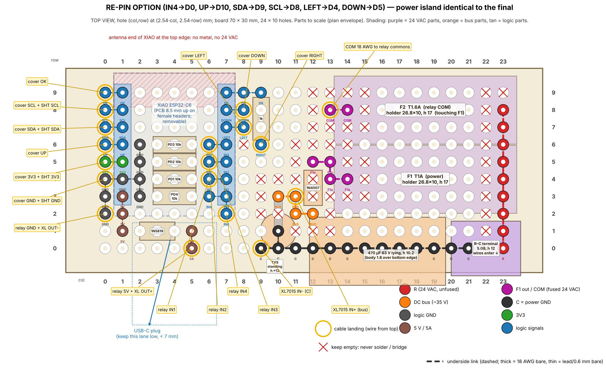

# Hardware

## HVAC wiring at the wall

The system is a heat pump with electric aux strips, controlled by a 2-heat / 1-cool thermostat.

| Wire | Old terminal | Function |
|---|---|---|
| Red | Rh, jumpered to Rc | 24 VAC hot (one transformer) |
| Blue | C | 24 VAC common, which is board GND |
| Yellow | Y1 | Compressor |
| Green | G | Blower |
| Orange | O | Reversing valve, **energised in COOL** |
| White | W1/E, jumpered to W2 | Aux and emergency strips |

B is unused.

## Power

```
R ──F1 T1A──1N4007──┬─ 470µF 63V ─┬─ 1.5KE51A ─┬─ XL7015 (set 5.00 V) ──┬─ relay module DC+
                    │             │            │                        └─1N5819─ XIAO 5V
C ──────────────────┴─────────────┴────────────┴─ GND (relay DC−, XIAO GND)

R ──F2 T1.6A── relay COM1..COM4 (jumpered)
```

- **Half-wave rectification.** It keeps C = GND, so plugging USB into a PC while the board is on 24 VAC is safe. Check C-to-earth continuity first anyway.
- **Bus voltage.** The DC bus sits at about 33–39 V peak. The XL7015 accepts 5–80 V. Set its output to 5.00 V **before** connecting any load, then lock the trimpot with a dab of nail polish.
- **Relay contacts.** The contacts switch R onto Y1, G, O and W. The SRD relays are rated 10 A.
- **F2 sizing.** About 1.25 A is the contactor *inrush*, which a T fuse rides through; the steady Heat + aux load is typically 0.6–1.2 A. After installation, clamp-meter R in heat, cool, heat + aux and e-heat. Keep T1.6A if the steady current is ≤ 1.1 A, otherwise fit T2A (18 AWG and the contacts allow it).

## Relay module (AEDIKO 4-ch, H/L trigger)

- **Board (measured).** The PCB is 73 × 50 mm, with Ø3.1 mm holes on a 67 × 44.5 mm pattern. Relays stand 15.5 mm above the board, the screw terminals 10 mm.
- **Terminals.** All connections are screw terminals: a 12-way block along one long edge (NO, COM, NC for each relay) and a 6-way block for DC+, DC−, IN1–IN4. There is no pin header to remove. Mount the module with the 12-way block toward the wire window.
- **Jumpers.** Set all four trigger jumpers S1–S4 to **H**. This board has no JD-VCC jumper.
- **Clearance.** The relay tops sit 1–2 mm under the cover. The module must sit flat on its four bosses.
- **Light leaks.** Cover the on-board relay LEDs with Kapton so they don't glow through the top vents.
- **Terminal order is not confirmed.** The CAD assumes NO, COM, NC from the left of each group. Bring-up step 2 checks it before any field wire lands; paint-mark the four NO screws.
- **3.3 V drive.** The IN inputs must pull in from a XIAO GPIO (3.3 V), not just from 5 V. If they don't (see step 2), set S1–S4 to **L** and add one NPN per channel (2N3904, 2N2222 or a 2N7000): collector to IN, emitter to GND, base from the GPIO through 2.2–4.7 k, and keep the 10 k pull-down on the GPIO. GPIO high still means energised and a floating or low GPIO still means off. Never use an inverting pull-up stage in H mode: every relay would turn on at boot.

| Channel | Load |
|---|---|
| IN1 | Y1 |
| IN2 | G |
| IN3 | O |
| IN4 | W |

## Pin map

**Board: Seeed XIAO ESP32-C6.** The assignments live in `components/board/include/board.h`, so re-pinning is a single edit.

Pin map v2 (Oct 8, 2026), chosen with the round-5 board so that the four relay inputs sit together on D0–D3 and no relay input is next to 3V3, 5V, SDA/SCL or a pin the ROM drives.

| XIAO pin | GPIO | Use |
|---|---|---|
| D0 | 0 | IN4, W (an LP GPIO and the XTAL_32K_P pad; not strapping, no 32 kHz crystal on the XIAO C6) |
| D1 | 1 | IN1, Y1 |
| D2 | 2 | IN2, G |
| D3 | 21 | IN3, O |
| D9 | 20 | I2C SDA (SHT40 + OLED) |
| D8 | 19 | I2C SCL |
| D10 | 18 | D-pad up |
| D5 | 23 | D-pad down |
| D4 | 22 | D-pad left |
| D6 | 16 | D-pad right, **through a 1 k series resistor**. This is also U0TXD: the boot ROM drives it as the serial TX line at reset, so holding the key then would short a driven output to ground without the resistor. |
| D7 | 17 | D-pad centre |

- The D-pad switches each pull to GND and use the internal pull-ups.
- Pins a relay must never use, enforced by `tools/check_safety_sources.py`: strapping GPIO 4, 5, 8, 9 and 15; USB-Serial-JTAG GPIO 12 and 13; UART0 TX GPIO 16; SPI flash GPIO 24–30. The RF switch uses GPIO 3 and 14; leave them alone.
- Checked against Seeed's XIAO ESP32-C6 pinout (Oct 2026). GPIO15 is the on-board user LED and a strapping pin; GPIO3 (low = RF switch on) and GPIO14 (low = built-in antenna) are set by `board_init()`.
- The on-board user LED (GPIO15) blinks the output state in the bench (sim) build only.
- **Fit a 10 k pull-down from each IN pin to GND.** After a power-on the pins are floating inputs until the bootloader hook drives them low, tens of ms later.
- **After any other reset** (a crash, a watchdog, a software restart) the C6 keeps its GPIO outputs. The firmware drops the relays in the panic handler, in the restart path and again first thing in the bootloader (Oct 2026 bench check: without these, a relay stayed on about 0.67 s into the reboot).

## Controller board



**Round-5 layout with pin map v2**, from the board-only three-agent review (docs/reviews/board_r5_*.md; the layout is `repin_option` in board_r5_layout.json, drawing board_r5_layout_repin.png). It's a **30 × 70 mm perfboard, 10 × 24 holes**, no mounting holes. Hole (column, row) is at (2.54·col, 2.54·row) mm; columns run along the long side, row 0 is the bottom edge.

**In the enclosure** (`cad/fusion_case_v3.py`) the board sits in the same cradle with the XIAO's USB-C facing down, so the cover's USB cut is now in the **bottom wall** (15 × 9 mm, under the XIAO). The cables run like this:

- **Relay harness:** down the left lane to the bottom edge, then fans to (0,2), (5,0) and (7,2). IN1–IN3 run up the trough under the XIAO.
- **Cover/SHT40 bundle:** drops at the top-left corner to column 0. LEFT, DOWN and RIGHT branch off to the right of the XIAO.
- **Field R and C:** go down the right-hand gutter and into the terminal's bottom entries.
- **XL7015 IN pair:** goes along the bottom edge to (9,0) and (11,3).
- **COM:** rises from (13,8).

**Closing the case (round-6 review):**
- Tape or hot-glue the XL7015 IN pair to the rim's inner face, then sight along the bottom rim before closing so the cover wall doesn't pinch it.
- Lace the cover bundle into a stiff loom with 2–3 small ties so it stays high along y −13, 5 mm clear of the XIAO's antenna end.
- Land the 18 AWG COM at (13,8) stripped about 2 mm above the board, and bend it clear of F2's base straight away.
- Hold the board down beside the holder, or use a fuse puller, when swapping a fuse.
- Unplug USB before lifting the cover.
- Screws thread-form into printed pilots sized just over the screw core (M2 Ø1.9, M3 Ø2.8, each with a lead-in). Drive them straight and stop as soon as the head seats; over-torquing twists a post off at its base layer.
- A block on the bottom rim under the USB plug takes the pull when you unplug.
- Log Thread RSSI with the cover on before final install.

The model is built from the BOM sizes, so re-check it once the measurements in build step 1 are in.

- **Zones:** logic in columns 0–9 with the XIAO standing upright (antenna at the top edge, USB-C toward the bottom edge); 24 VAC and the bus in columns 9–23. No R, 24 VAC or bus pad touches a logic pad, straight or diagonally; 24 VAC is 8 mm from the nearest logic pad and 14 mm from the antenna.
- **Underside:** 25 links, all bare and flat, no crossings: logic links are lead offcuts (1–3 pitches); power links are 18 AWG.

| Part | Holes (net) | Placement |
|---|---|---|
| XIAO ESP32-C6 on 2 × 7 female headers | column 7, rows 3–9: D0 IN4, D1 IN1, D2 IN2, D3 IN3, D4 LEFT, D5 DOWN, D6. Column 1, rows 3–9: 5V, GND, 3V3, D10 UP, D9 SDA, D8 SCL, D7 OK | Upright; remove the header spacer so the PCB sits 8.5 mm up |
| 10 k pull-downs IN4, IN1, IN2, IN3 | (6,3)→(2,3), (6,4)→(2,4), (6,5)→(2,5), (6,6)→(2,6) | Lying along x under the XIAO; GND bus down column 2 |
| 1N5819 | cathode (1,1) 5V, anode (5,1) | Lying along x |
| 1 k (D6 → RIGHT) | (9,9) D6, (9,6) RIGHT | Lying along y |
| F1 T1A holder | in (23,4) R, out (14,4) | Along x |
| F2 T1.6A holder | in (23,8) R, out (14,8) COM | Along x, side by side with F1 (0.16 mm gap; holder base measured 10.0 mm) |
| R-C terminal, 5.08 | C (21,0), R (23,0) | Wire entries face the bottom edge |
| 470 µF 63 V | − (11,0), **+ (11,2)** | Lying along x, leads bent down 2.0 mm from the bung with a ~2.9 mm dog-leg; overhangs the bottom edge 1.8 mm |
| 1.5KE51A TVS | anode (10,1), cathode (10,3) | Standing: body over (10,1), sleeved cathode hairpin into (10,3) |
| 1N4007 | anode (12,5), cathode (12,2) | Lying along y |

**Cable landings** (every wire enters from the top; drill shared holes to 1.3 mm):

| Hole | Wire |
|---|---|
| (0,2) | relay GND + XL7015 OUT− |
| (5,0) | relay 5V + XL7015 OUT+ |
| (7,2) | relay IN4 |
| (6,4), (6,5), (6,6) | relay IN1, IN2, IN3 (run up under the XIAO from the USB end; land them before fitting the XIAO) |
| (0,4) | cover GND + SHT40 GND |
| (0,5) | cover 3V3 + SHT40 3V3 |
| (0,6) | cover UP |
| (0,7), (0,8) | SDA, SCL (cover + SHT40 twisted per hole) |
| (0,9) | cover OK |
| (8,7), (8,8) | cover LEFT, DOWN |
| (9,6) | cover RIGHT |
| (9,0), (11,3) | XL7015 IN− (C), IN+ (bus) |
| (13,8) | 18 AWG COM wire to the relay commons (drill 1.3) |
| terminal (23,0), (21,0) | field R, C |

**Underside links**
- **Relay inputs:** IN4 (7,3)–(7,2) and (7,3)–(6,3); IN1/IN2/IN3 (7,r)–(6,r) for r = 4, 5, 6.
- **GND:** (1,4)–(0,4)–(0,3)–(0,2); (1,4)–(2,4); column 2 (2,3)–(2,6).
- **Supplies:** 5V (1,3)–(1,2)–(1,1); 5A (5,1)–(5,0); 3V3 (1,5)–(0,5).
- **Keys and I2C:** UP (1,6)–(0,6), SDA (1,7)–(0,7), SCL (1,8)–(0,8), OK (1,9)–(0,9), LEFT (7,7)–(8,7), DOWN (7,8)–(8,8), D6 (7,9)–(8,9)–(9,9).
- **Power (18 AWG):** R straight down column 23, (23,0)…(23,8); C straight along row 0, (9,0)…(21,0), plus (10,1)–(10,0); bus (10,3)–(11,3)–(11,2)–(12,2); F1 out (14,4)–(13,4)–(13,5)–(12,5); COM (13,8)–(14,8).

**Never solder or bridge:**
- all of column 22, and (23,9);
- around the bus, F1 out and COM: (8,6), (9,2..4), (10,2), (10,4), (11,1), (11,4..6), (12,1), (12,3), (12,4), (12,6..9), (13,1..3), (13,6), (13,7), (13,9), (14,3), (14,5..7), (14,9), (15,3..5), (15,7..9).

With pin map v2 no relay input has a neighbour that could hold it high at boot. A bridge between two inputs, or an input and the LEFT key line, is caught by step 0 (IN → GND reads 5 k instead of 10 k, or IN → LEFT is not open).

**Build order**
1. **Measure:**
   - fuse-holder installed height (≤ 17.9 mm);
   - cap diameter over the sleeve (≤ 10.5);
   - terminal pin line to back face (≤ 4.8);
   - TVS lead diameter;
   - 1/4 W body length (≤ 6.5);
   - XIAO USB face to the D0 pin.
2. **Drill:** (13,8), the shared landing holes, and the TVS/terminal holes if their leads bind.
3. **Fuse holders.** Solder the header pins to the legs with the board as the jig, tug-test them and check ≤ 0.05 Ω.
4. **Power straps:** R down column 23, then C along row 0.
5. **Terminal and fuse holders,** then the 1N4007 and the F1-out link, the TVS, and the 470 µF last (**+ in (11,2)**).
6. **Partial step 0,** then bench step 1 with only the XL7015 IN pair landed.
7. **Logic parts:**
   1. the pull-downs, the 1N5819 and the 1 k;
   2. the bridges;
   3. the female headers, using the XIAO as the jig.
8. **Full step 0.** Then land the cables with the XIAO out, the under-XIAO wires first, and fit the XIAO.

- **Off the board:** the 100 nF capacitors (the XL7015 output one goes on its own terminals), the optional I2C pull-ups (on a module, only if a probe shows none), and the optional NPN drivers.
- **Fuse holders:** the header pins must be **soldered** to the clip legs; CA glue doesn't conduct.
- **Antenna fallback:** if Thread signal is poor, use the U.FL port with an FPC antenna (GPIO14).

## Sensor

- MusRock SHT40 module, measured 12.56 × 10.5 mm, 2.85 mm hole near one corner, pins VIN GND SCL SDA on the opposite edge. I2C address 0x44.
- It lies flat, sensor side up, in its own vented chamber at the bottom right of the case, 14 mm off the wall plane. One M2 × 6 goes into a slim standoff, and the board rests on two thin posts (slim on purpose: they carry wall heat into the sensor).
- The wires pass through a TPU grommet in the double-skin divider. Knife-cut a slit from the top of the grommet down to its channel and press the 4 × 26 AWG cable in; the cover squeezes it shut.
- Firmware applies an offset that depends on how many relays are energised; each coil dissipates about 0.35 W.
- **Calibration:** the backplate still pulls the reading 16–28 % of the way toward the wall-surface temperature. Log it against a reference thermometer over a cold night before trusting the offset, especially on an exterior wall.

## UI

- 0.96" SSD1306 I2C OLED at 0x3C. Remove its header and solder wires directly.
- 5-way D-pad made of five lever micro switches, the same type as the NTP desk clock.
- **Cover connectors** (so the cover can come off): one JST-PH 6-pin pair for the D-pad and one JST-PH 4-pin pair for the OLED, inline on pigtails (PH is 2.0 mm pitch, so it doesn't fit the perfboard). The mated pairs lie flat under the D-pad carrier with about 80 mm of cover-side slack; tack them to the backplate with hot glue.
  - D-pad 6-pin: GND, UP, DOWN, LEFT, RIGHT, OK.
  - OLED 4-pin and the optional SHT40 4-pin: **both in the same order, GND, 3V3, SDA, SCL**, so swapping them does no harm.
  - Paint pin 1 on every housing.
- **The relay cable has no connector.** Solder it at the controller and screw it into the module's 6-way block. A 6-pin plug there could mate with the D-pad's, and a key press would then put 5 V on a GPIO or short the 5 V rail.
- **Strain relief:** hot-glue the OLED wires to its PCB next to the pads, and tie or glue the D-pad bundle to the carrier.
- **I2C pull-ups:** check both modules. If the SHT40 module has none, fit 10 k from SDA and SCL to 3V3 on the controller (with the OLED's 4.7 k that gives about 3.2 k).
- **Centre key guides:** two 5.7 mm lengths of 1.75 filament (cut to 5.65), CA-glued into the Ø2.0 blind holes in the centre key's flange (lead-in at the mouth); they slide in the carrier's Ø2.1 sockets. If a pin drags in its socket, run a 2 mm drill bit through it by hand.

## BOM (all ordered from Amazon, Oct 2026)

| Part | Qty used |
|---|---|
| Seeed XIAO ESP32-C6 (3-pack) | 1 |
| AEDIKO 4-ch 5 V relay module, optocoupled (2-pack) | 1 |
| XL7015 DC-DC buck, 5–80 V in (3-pack) | 1 |
| MusRock SHT40 module (2-pack) | 1 |
| 1.5KE51A TVS | 1 |
| uxcell 5×20 PCB fuse holders | 2 |
| BOJACK 5×20 slow-blow fuses: T1A (F1), T1.6A (F2) | 2 |
| Cermant 470 µF 63 V electrolytic, 10×20 | 1 |
| 1N4007 and 1N5819 (from the ALLECIN diode kit) | 1 each |
| 100 nF ceramics (from the BOJACK kit) | several |
| 5.08 mm screw terminals (from the QSYZAIL kit) | R, C plus field wires |
| 0.96" SSD1306 OLED | 1 (on hand) |
| Lever micro switches | 5 (on hand) |
| 30 × 70 perfboard, 10 × 24 holes (held in a cradle, no screws); M3 × 10 and M2 × 6 button-head screws (threaded straight into PETG, no inserts); #8 screws and anchors | — |
| JST-PH pigtail pairs: one 6-pin (D-pad), one or two 4-pin (OLED, optional SHT40) | — |
| 1 k resistor (D6 line), 10 k pull-downs (IN1–IN4) | 1 + 4 |
| Optional: 10 k I2C pull-ups; 2N3904 / 2N2222 / 2N7000 relay drivers + 2.2–4.7 k base resistors | 2; 4 + 4 |
| 1.75 mm filament (switch retention pins, centre key guides) | — |

## Bring-up order

0. **Board ohm test, before any power** (mandatory):
   - each IN pin to GND: **10.0 kΩ** (about 5 kΩ means two IN pins are bridged; IN-to-IN reads about 20 kΩ through the pull-downs, which is normal);
   - each IN pin to 3V3, 5V, SDA, SCL, D6 and every key line: **> 1 MΩ**;
   - once the XL7015 is connected: C to the XIAO GND 0 Ω (they join only through the XL7015);
   - R to C, to the bus and to every logic net: open;
   - the bus to C: charges up, not 0 Ω;
   - 3V3 and 5V to GND: not shorted.
1. Power stage alone on the bench, from a 24 VAC supply or the real R/C wires:
   - check the bus voltage;
   - set the XL7015 to 5.00 V;
   - check ripple under a 0.5 A load.
2. Relay module, **before any field wire lands**:
   1. Module unpowered: each terminal you plan to use must read **open** to its COM. The third terminal of each group reads **closed** to COM; that one is NC and stays unused.
   2. Power the module from 5 V and drive each IN from a **XIAO GPIO at 3.3 V** (not from 5 V). The relay must pull in solidly, the used terminal must close to COM, and the IN current should be at least 1.5–2 mA. If not, switch to L mode with NPN drivers (see the relay module section).
   3. Paint-mark the four NO screws.
   4. **Required after the pin-map v2 change:** scope IN4 (D0, GPIO0) and the other IN pins through power-on, reset and an esptool flash; they must stay below about 1 V. Then re-run the bench checks below (relays drop on reboot and on panic) with the v2 firmware.
3. C6 bench (sim) build: outputs on LEDs, display and D-pad, with the HVAC logic running against a simulated room, paired with Apple Home over Thread. Done (Oct 2026).
4. C6 real build with the SHT40 and the relay module, still driving **LEDs, not the HVAC system**.
5. Wire to the real system with the compressor timer verified. Test fan, then heat, then cool, then aux, then emergency heat.

## Bench checks (C6, before the wall)

Run these on the bench with LEDs (or the relay module) on IN1–IN4 and no HVAC attached. The `matter esp ...` commands need a debug build (`tools/matter.sh build debug`); the serial console is `pio device monitor -p COM10 -b 115200`.

| Check | How | Pass |
|---|---|---|
| Relays drop on a reset | Energise a relay (fan On), then `matter esp reboot`, and again with `matter esp panic`. | The relay drops at once, and the next boot logs `relays: relay pins idle at start-up`, not `still driven`. |
| E-heat survives a reboot | Turn e-heat on in Home, wait 5 s, then power-cycle; repeat with `matter esp reboot` and with an `-app.bin` flash. | Still e-heat on the OLED and in Home; no `from Matter:` line during boot. |
| Sensor fault | Pull the SHT40's SDA lead. | After 2 min: every output off, OLED fault, Home's "Thermostat fault" opens. Reconnect: valid again only after 1 min of good reads. |
| Bench build on a real board | Flash the `-sim` build with the SHT40 connected. | Log: `SHT40 found ... will not drive its relays`; the relays stay off. |
| Fixed attributes | `matter esp attribute set 0x1 0x201 0x19 127` (deadband). | Refused; Home setpoint changes still work. |
| Factory reset | Settings › Factory reset: centre, then centre on No; then centre, Down to Yes, centre. | No does nothing. Yes shows "Factory reset", restarts in mode Off, and the Pair page shows the QR code. |
| Timing rules | Run a day with the real build, saving the log; `python tools/check_relay_log.py bench.log`. | `RESULT: PASS`. |
